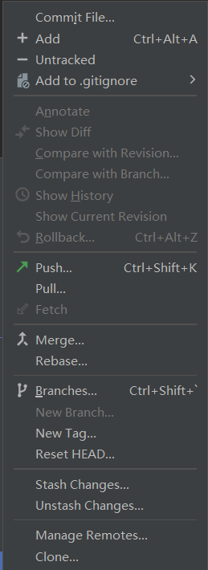

# Git Extend Untracked

An intelliJ IDEA plugin to add the extended feature of remove the files from git vcs.

## Screenshots

## License
The software is licensed under the [Apache-2.0 License](LICENSE).
